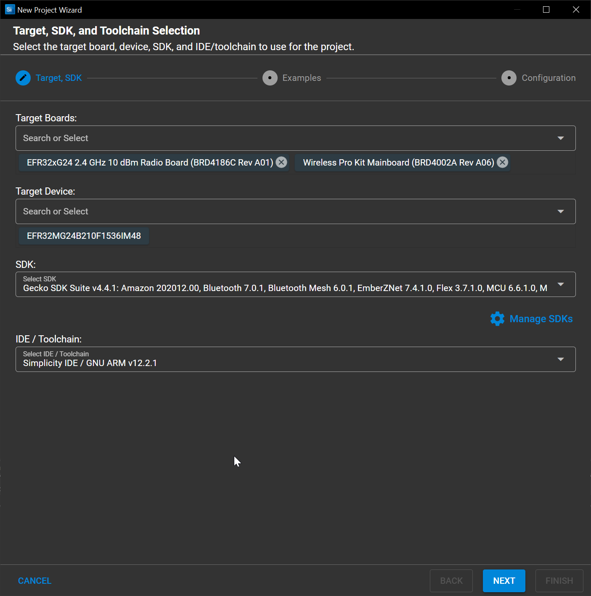
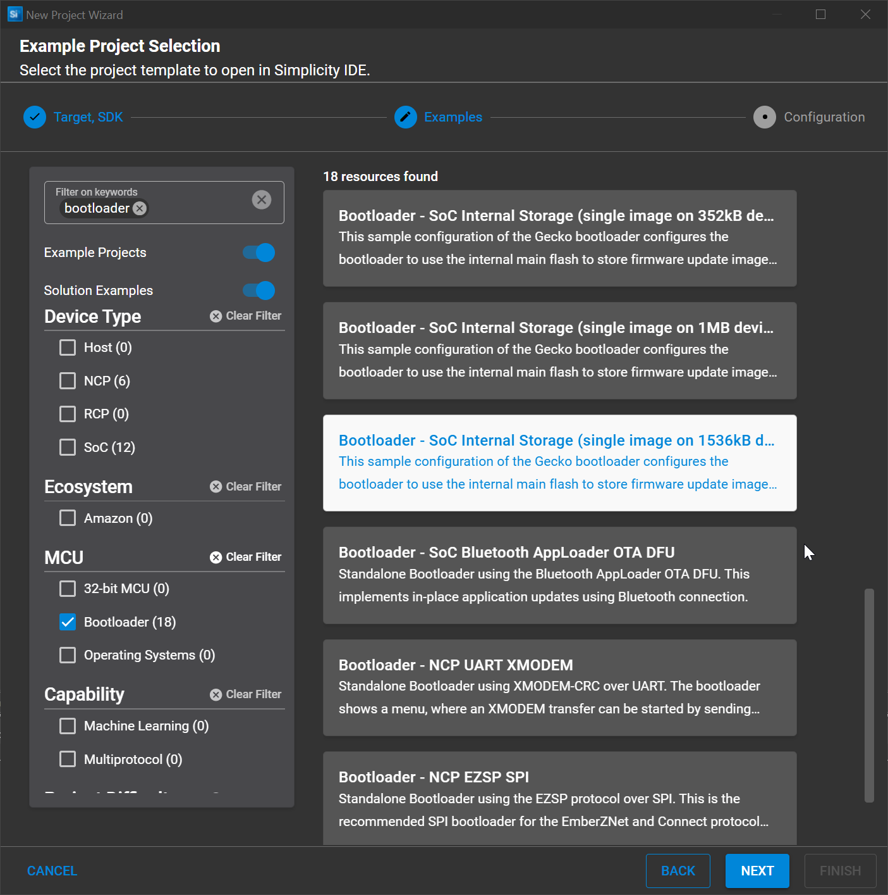
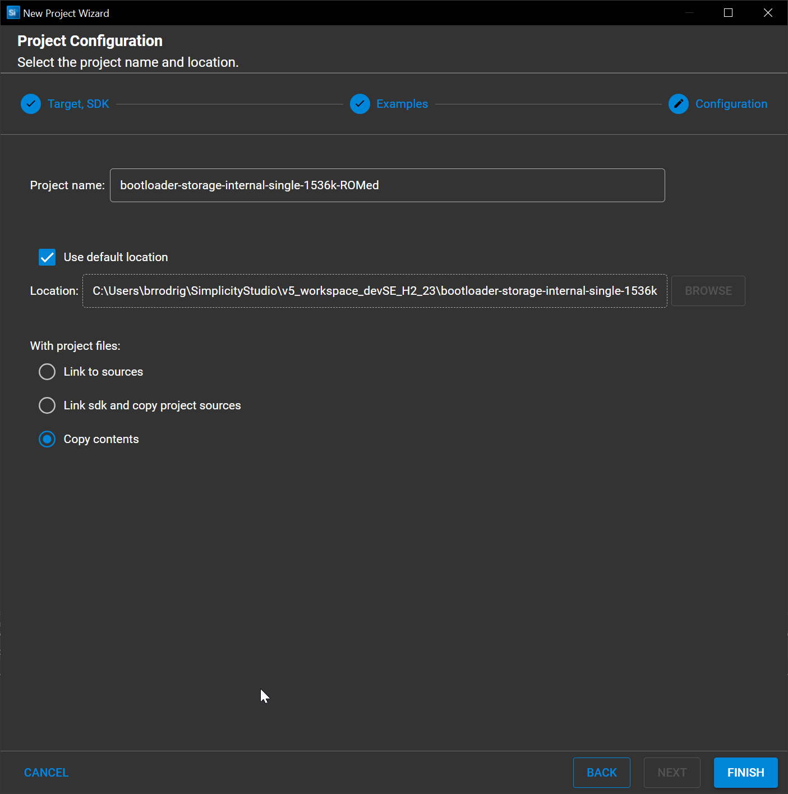

# Bootloader Project Creation

1. Plug-in your radio board + dev kit to your computer
2. Open `Simplicity Studio > File > New > Silicon Labs Project Wizard`
3. If your radio board was plugged in and GSDK installed, you should have all fields pre-filled.

   Otherwise just customize the project base settings accordsing to your needs

   

   In this case we will be using a `BRD4186C` radio board
4. On the subsequent screen select `Bootloader - SoC Internal Storage (single image on 1536kB device)

   

   This will create a Gecko Bootloader project with internal flash storage support

   It will bring in the minimum required to get started with a radio board

   Click Next
5. Rename your project as you whish

   

   If you wish to, you can also set your project to copy all sources from the Gecko SDK locally upon configuration

   This allows for easier versioning but complexifies import/export
6. Click Finish to proceed with project creation
